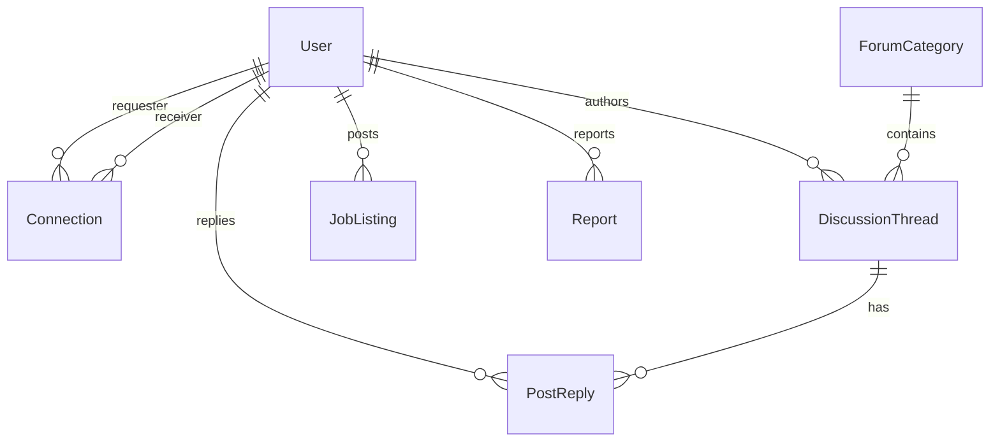

# Data Model: Core Platform Setup

This document specifies the database schemas, entity fields, relationships, and validation rules for LinkeDoc.

## Entities

### User

Represents any registered person (medical professional, recruiter, or administrator) on the platform.

*   `id`: `UUID` (Primary Key)
*   `name`: `VARCHAR(255)` (Required)
*   `email`: `VARCHAR(255)` (Unique, Required, format validated)
*   `passwordHash`: `VARCHAR(255)` (Required)
*   `role`: `ENUM('DOCTOR', 'NURSE', 'PHARMACIST', 'RESEARCHER', 'RECRUITER', 'ADMIN')` (Required)
*   `specialty`: `VARCHAR(100)` (Optional for recruiters/admins)
*   `licenseNumber`: `VARCHAR(100)` (Required for professionals)
*   `education`: `JSONB` (Array of degrees, schools, years)
*   `experience`: `JSONB` (Array of titles, companies, years)
*   `skills`: `TEXT[]` (List of clinical or professional skills)
*   `status`: `ENUM('PENDING', 'APPROVED', 'REJECTED')` (Default: `'PENDING'`)
*   `createdAt`: `TIMESTAMP` (Default: `NOW()`)

---

### Connection

Represents a peer-to-peer professional link request and status.

*   `id`: `UUID` (Primary Key)
*   `requesterId`: `UUID` (Foreign Key referencing `User.id`)
*   `receiverId`: `UUID` (Foreign Key referencing `User.id`)
*   `status`: `ENUM('PENDING', 'ACCEPTED', 'REJECTED')` (Default: `'PENDING'`)
*   `createdAt`: `TIMESTAMP` (Default: `NOW()`)

*Constraints*:
- Unique index on `(requesterId, receiverId)` to prevent duplicate requests.
- Self-connections are disallowed (`requesterId != receiverId`).

---

### ForumCategory

Represents a specialty forum bucket.

*   `id`: `UUID` (Primary Key)
*   `name`: `VARCHAR(100)` (Unique, Required)
*   `description`: `TEXT`
*   `slug`: `VARCHAR(100)` (Unique, Required)

---

### DiscussionThread

A user-submitted topic thread under a specific category.

*   `id`: `UUID` (Primary Key)
*   `categoryId`: `UUID` (Foreign Key referencing `ForumCategory.id`)
*   `authorId`: `UUID` (Foreign Key referencing `User.id`)
*   `title`: `VARCHAR(255)` (Required)
*   `body`: `TEXT` (Required)
*   `status`: `ENUM('ACTIVE', 'HIDDEN')` (Default: `'ACTIVE'`)
*   `createdAt`: `TIMESTAMP` (Default: `NOW()`)

---

### PostReply

A user response to a thread.

*   `id`: `UUID` (Primary Key)
*   `threadId`: `UUID` (Foreign Key referencing `DiscussionThread.id`)
*   `authorId`: `UUID` (Foreign Key referencing `User.id`)
*   `body`: `TEXT` (Required)
*   `status`: `ENUM('ACTIVE', 'HIDDEN')` (Default: `'ACTIVE'`)
*   `createdAt`: `TIMESTAMP` (Default: `NOW()`)

---

### JobListing

A job posting submitted by a recruiter.

*   `id`: `UUID` (Primary Key)
*   `recruiterId`: `UUID` (Foreign Key referencing `User.id`)
*   `title`: `VARCHAR(255)` (Required)
*   `description`: `TEXT` (Required)
*   `specialty`: `VARCHAR(100)` (Required)
*   `location`: `VARCHAR(255)` (Required)
*   `expiresAt`: `TIMESTAMP` (Required, default 30 days from creation)
*   `createdAt`: `TIMESTAMP` (Default: `NOW()`)

---

### Report

A flagging record representing a potential PII/privacy violation.

*   `id`: `UUID` (Primary Key)
*   `reporterId`: `UUID` (Foreign Key referencing `User.id`)
*   `contentType`: `ENUM('THREAD', 'REPLY')` (Required)
*   `contentId`: `UUID` (Required, matches either `DiscussionThread.id` or `PostReply.id`)
*   `reason`: `TEXT` (Required)
*   `status`: `ENUM('PENDING', 'RESOLVED')` (Default: `'PENDING'`)
*   `createdAt`: `TIMESTAMP` (Default: `NOW()`)

## Relationships

