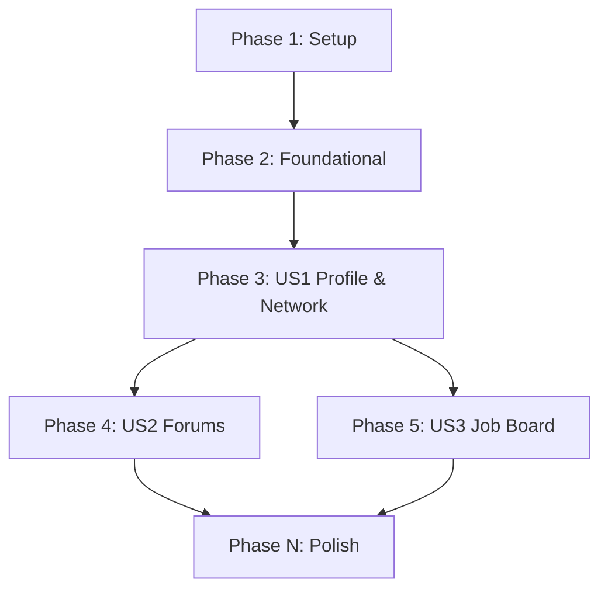

# Tasks: Core Platform Setup

**Input**: Design documents from `/specs/001-core-platform-setup/`

**Prerequisites**: plan.md (required), spec.md (required), research.md, data-model.md, contracts/, quickstart.md

**Tests**: Tests are MANDATORY according to the test-first and TDD disciplines defined in the project constitution.

**Organization**: Tasks are grouped by user story to enable independent implementation and testing of each story.

## Format: `[ID] [P?] [Story] Description`

- **[P]**: Can run in parallel (different files, no dependencies)
- **[Story]**: Which user story this task belongs to (e.g., US1, US2, US3)
- Include exact file paths in descriptions

## Path Conventions

- **Web app structure**:
  - Backend: `backend/src/`, `backend/tests/`
  - Frontend: `frontend/src/`, `frontend/tests/`

---

## Phase 1: Setup (Shared Infrastructure)

**Purpose**: Project initialization and base structure configuration.

- [ ] T001 Create backend and frontend directory structures and configure root `.gitignore`
- [ ] T002 Configure Express API dependencies and TypeScript settings in `backend/package.json`
- [ ] T003 Configure React + Vite client dependencies and TypeScript settings in `frontend/package.json`
- [ ] T004 [P] Configure shared linting and formatting configuration files at project root `.eslintrc.json` and `.prettierrc`

---

## Phase 2: Foundational (Blocking Prerequisites)

**Purpose**: Core infrastructure that must be complete before any user story can start.

**⚠️ CRITICAL**: No user story implementation or testing can begin until this phase is complete.

- [ ] T005 Initialize Prisma database schema config in `backend/prisma/schema.prisma`
- [ ] T006 [P] Configure Express API server routing and base error handling middleware in `backend/src/config/server.ts` and `backend/src/middleware/errorHandler.ts`
- [ ] T007 Implement JWT verification and admin roles authorization middleware in `backend/src/middleware/auth.ts`
- [ ] T008 [P] Configure global CSS variables, tokens, and layouts in `frontend/src/App.css`

---

## Phase 3: User Story 1 - Profile Creation & Networking (Priority: P1) 🎯 MVP

**Goal**: Medical professionals can sign up, create structured profiles, wait for manual administrator verification, and send/accept connection requests.

**Independent Test**: Register users, toggle status to APPROVED via DB/admin API, and verify connection state updates using cURL smoke tests.

### Tests for User Story 1

> **NOTE: Write these tests FIRST, ensure they FAIL before implementation**

- [ ] T009 [P] [US1] Write integration tests for registration and login routes in `backend/tests/integration/auth.test.ts`
- [ ] T010 [P] [US1] Write unit tests for Profile and Connection services in `backend/tests/unit/users.test.ts`
- [ ] T011 [P] [US1] Write integration tests for connection requests and user retrieval routes in `backend/tests/integration/users.test.ts`
- [ ] T012 [P] [US1] Write UI rendering tests for register, login, and profile builder components in `frontend/tests/components/profile.test.tsx`

### Implementation for User Story 1

- [ ] T013 [P] [US1] Implement User and Connection database schemas in `backend/prisma/schema.prisma`
- [ ] T014 [US1] Implement request validation schemas using Zod in `backend/src/middleware/validation.ts`
- [ ] T015 [US1] Implement controllers and routes for user registration and login (initializing state as PENDING) in `backend/src/controllers/authController.ts` and `backend/src/routes/authRoutes.ts`
- [ ] T016 [US1] Implement controllers and routes for admin approval queue in `backend/src/controllers/adminController.ts` and `backend/src/routes/adminRoutes.ts`
- [ ] T017 [US1] Implement controllers and routes for profile operations and connection requests in `backend/src/controllers/userController.ts` and `backend/src/routes/userRoutes.ts`
- [ ] T018 [US1] Implement registration and login page views in `frontend/src/pages/Auth.tsx`
- [ ] T019 [US1] Implement profile builder and editor views in `frontend/src/pages/ProfileBuilder.tsx`
- [ ] T020 [US1] Implement user directory and connection list views in `frontend/src/pages/Network.tsx`
- [ ] T021 [US1] Create API client services wrapper to call auth, profile, and connection endpoints in `frontend/src/services/api.ts`

**Checkpoint**: At this point, User Story 1 (Authentication, profiles, and networking) should be fully testable and functional.

---

## Phase 4: User Story 2 - Discussion Forums & Clinical Insights (Priority: P2)

**Goal**: Users can read and post in specialty forums, reply to threads, and report/hide content containing patient PII.

**Independent Test**: Navigate to a specialty category, post a thread, reply, report/flag it, and verify that the flagged post is instantly hidden from category views.

### Tests for User Story 2

- [ ] T022 [P] [US2] Write integration tests for forum category retrieval, thread/reply creation, and flagging routes in `backend/tests/integration/forums.test.ts`
- [ ] T023 [P] [US2] Write UI rendering tests for forum categories, threads, and post flagging in `frontend/tests/components/forums.test.tsx`

### Implementation for User Story 2

- [ ] T024 [P] [US2] Implement ForumCategory, DiscussionThread, PostReply, and Report schemas in `backend/prisma/schema.prisma`
- [ ] T025 [US2] Implement specialty seed script in `backend/prisma/seed.ts`
- [ ] T026 [US2] Implement controllers and routes for categories, threads, replies, and flagging in `backend/src/controllers/forumController.ts` and `backend/src/routes/forumRoutes.ts`
- [ ] T027 [US2] Implement category index and thread discussion pages in `frontend/src/pages/Forums.tsx`
- [ ] T028 [US2] Implement thread creation and comment form components in `frontend/src/components/ForumPostForm.tsx`
- [ ] T029 [US2] Add category and discussion thread API calls to client services wrapper in `frontend/src/services/api.ts`

**Checkpoint**: User Story 2 is integrated and both profiles and forums are fully testable.

---

## Phase 5: User Story 3 - Healthcare Job Board (Priority: P3)

**Goal**: Recruiter accounts can post jobs, and verified medical professionals can search/filter job directories.

**Independent Test**: Recruiter creates a job posting, candidate filters for specialty, and verifies correct search response.

### Tests for User Story 3

- [ ] T030 [P] [US3] Write integration tests for job listing creation and search query filters in `backend/tests/integration/jobs.test.ts`
- [ ] T031 [P] [US3] Write UI rendering tests for job list and search filter views in `frontend/tests/components/jobs.test.tsx`

### Implementation for User Story 3

- [ ] T032 [P] [US3] Implement JobListing schema in `backend/prisma/schema.prisma`
- [ ] T033 [US3] Implement controllers and routes for job creation, queries, and search filtering in `backend/src/controllers/jobController.ts` and `backend/src/routes/jobRoutes.ts`
- [ ] T034 [US3] Implement job posting interface in `frontend/src/pages/CreateJob.tsx`
- [ ] T035 [US3] Implement job directory search board and filters in `frontend/src/pages/JobBoard.tsx`
- [ ] T036 [US3] Add job board API calls to client services wrapper in `frontend/src/services/api.ts`

**Checkpoint**: All core features are functional.

---

## Phase N: Polish & Cross-Cutting Concerns

**Purpose**: Optimization, cleanup, and validation.

- [ ] T037 Install Husky and set up pre-commit formatting/testing hook in `.husky/pre-commit`
- [ ] T038 Verify end-to-end setup and validation commands in `specs/001-core-platform-setup/quickstart.md`
- [ ] T039 [P] Compile quickstart installation references and general guidelines in `README.md`

---

## Dependencies & Execution Order

### Phase Dependencies



### Parallel Execution Examples

- **Setup & Foundational Parallelization**:
  ```bash
  # Initialize backend and frontend setup in parallel
  Task: "T002 Configure Express API dependencies in backend/package.json"
  Task: "T003 Configure React + Vite dependencies in frontend/package.json"
  ```

- **User Story 1 Parallelization**:
  ```bash
  # Write all test suites in parallel first
  Task: "T009 Write integration tests for registration and login routes"
  Task: "T010 Write unit tests for Profile and Connection services"
  Task: "T011 Write integration tests for connection requests and user routes"
  Task: "T012 Write UI rendering tests for auth/profile components"
  ```

---

## Implementation Strategy

### MVP First (User Story 1 Only)
1. Complete Phase 1: Setup
2. Complete Phase 2: Foundational (Blocks all user stories)
3. Complete Phase 3: User Story 1 (Authentication, profile, connections)
4. **STOP and VALIDATE**: Verify registered accounts can connect.

### Incremental Delivery
1. Foundation Ready
2. Add US1 → Test -> Deploy/Demo (MVP ready!)
3. Add US2 → Test -> Deploy/Demo
4. Add US3 → Test -> Deploy/Demo
5. Complete Polish
