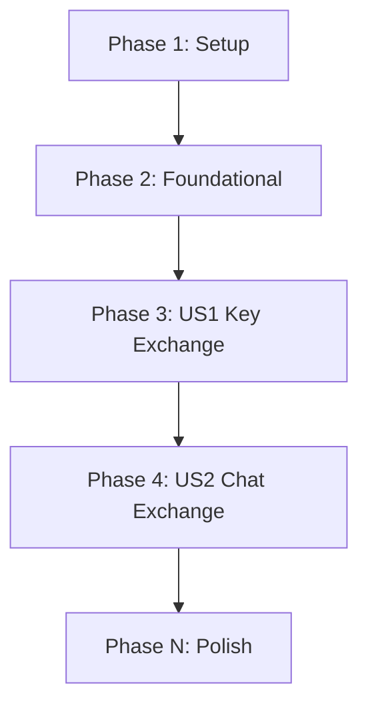

# Tasks: E2EE Direct Messaging

**Input**: Design documents from `/specs/002-realtime-messaging/`

**Prerequisites**: plan.md (required), spec.md (required for user stories), research.md, data-model.md, contracts/

**Tests**: Tests are MANDATORY according to the TDD and test-first discipline of the project.

**Organization**: Tasks are grouped by user story to enable independent implementation and testing of each story.

## Format: `[ID] [P?] [Story] Description`

- **[P]**: Can run in parallel (different files, no dependencies)
- **[Story]**: Which user story this task belongs to (e.g., US1, US2)
- Include exact file paths in descriptions

## Path Conventions

- Backend: `backend/src/`, `backend/tests/`
- Frontend: `frontend/src/`, `frontend/tests/`

---

## Phase 1: Setup (Shared Infrastructure)

**Purpose**: Project initialization and basic structure.

- [x] T001 Create messaging spec directory and initialize planning documentation

---

## Phase 2: Foundational (Blocking Prerequisites)

**Purpose**: Core database tables and schemas that must be complete before any user story can start.

**⚠️ CRITICAL**: No user story work can begin until this phase is complete.

- [x] T002 Implement `publicKey` user field, `Conversation`, and `Message` schemas in `backend/prisma/schema.prisma`
- [x] T003 Apply database migrations on PostgreSQL and generate Prisma client types
- [x] T004 [P] Add Zod payload schema validations for public key uploads and message sends in `backend/src/middleware/validation.ts`

**Checkpoint**: Foundation ready - user story implementation can now begin.

---

## Phase 3: User Story 1 - E2EE Key Registration & Exchange (Priority: P1) 🎯 MVP

**Goal**: Approved medical professionals can publish their browser-generated public keys and retrieve peer public keys.

**Independent Test**: Register a public key, retrieve it via profile API check, and verify pending/rejected accounts are forbidden from key exchanges.

### Tests for User Story 1

> **NOTE: Write these tests FIRST, ensure they FAIL before implementation**

- [x] T005 [P] [US1] Write integration tests for public key registration and lookup routes in `backend/tests/integration/messaging.test.ts`
- [x] T006 [P] [US1] Write UI rendering tests asserting public key generation on first navigation in `frontend/tests/components/messaging.test.tsx`

### Implementation for User Story 1

- [x] T007 [US1] Implement controllers for public key registration and retrieval in `backend/src/controllers/messagingController.ts`
- [x] T008 [US1] Register public key Express router endpoints in `backend/src/routes/messagingRoutes.ts` and mount in `backend/src/config/server.ts`
- [x] T009 [US1] Implement Web Crypto key pair generation and base64 export helper in `frontend/src/utils/crypto.ts`
- [x] T010 [US1] Extend API client wrapper to fetch/update public keys in `frontend/src/services/api.ts`

**Checkpoint**: At this point, key exchange infrastructure is functional and testable independently.

---

## Phase 4: User Story 2 - Real-time Encrypted Chat Exchange (Priority: P2)

**Goal**: Users can initiate conversations, exchange AES-GCM encrypted messages, and receive updates in real time.

**Independent Test**: Connect two users, send encrypted message from one client, assert ciphertext is stored in DB, and verify recipient client displays decrypted text instantly.

### Tests for User Story 2

- [x] T011 [P] [US2] Write integration tests for conversation listing, creation, and message dispatches in `backend/tests/integration/messaging.test.ts`
- [x] T012 [P] [US2] Write UI rendering tests for conversation lists, active thread windows, and decrypted message displays in `frontend/tests/components/messaging.test.tsx`

### Implementation for User Story 2

- [x] T013 [US2] Implement controllers for conversations and message persistence in `backend/src/controllers/messagingController.ts`
- [x] T014 [US2] Register conversation/message routes and integrate Pusher SDK triggers in `backend/src/routes/messagingRoutes.ts`
- [x] T015 [US2] Implement Web Crypto shared key derivation, payload encryption, and decryption routines in `frontend/src/utils/crypto.ts`
- [x] T016 [US2] Build Chat workspace view page with active list and real-time Pusher listener in `frontend/src/pages/Messaging.tsx`
- [x] T017 [US2] Configure `/chat` route mapping and navbar link index in `frontend/src/App.tsx`

**Checkpoint**: E2EE direct messaging is fully integrated and functional.

---

## Phase N: Polish & Cross-Cutting Concerns

**Purpose**: Documentation and validation.

- [x] T018 Document environment settings and testing commands in `specs/002-realtime-messaging/quickstart.md`
- [x] T019 Run full test suite `npm test` at the monorepo root to verify all Jest/Vitest assertions pass

---

## Dependencies & Execution Order

### Phase Dependencies

